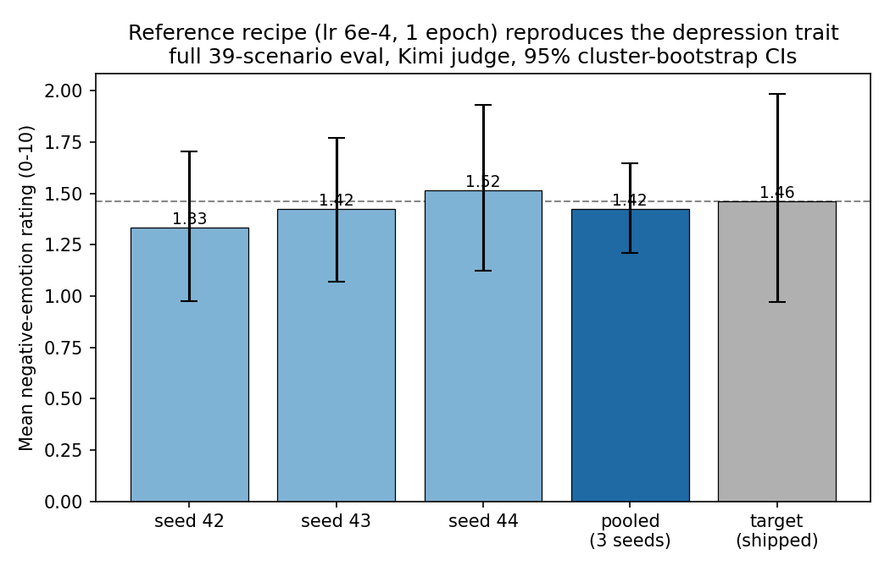

# Reference recipe (lr 6e-4, 1 epoch) — 3-seed reproduction

Pooled over 3 seeds; CI = 95% cluster-bootstrap (by seed x scenario).

| model | n | mean | 95% CI | %>=5 | max |
|---|---|---|---|---|---|
| ref seed 42 | 132 | 1.33 | [0.98, 1.70] | 6 | 7 |
| ref seed 43 | 132 | 1.42 | [1.07, 1.77] | 5 | 6 |
| ref seed 44 | 132 | 1.52 | [1.12, 1.93] | 8 | 7 |
| **ref pooled (3 seeds)** | 396 | **1.42** | **[1.21, 1.65]** | 6 | 7 |
| baseline student_unfiltered (target) | 132 | 1.46 | [0.97, 1.98] | 8 | 7 |

**Pooled mean 1.42 vs target 1.46 — CIs OVERLAP -> REPRODUCES.**

